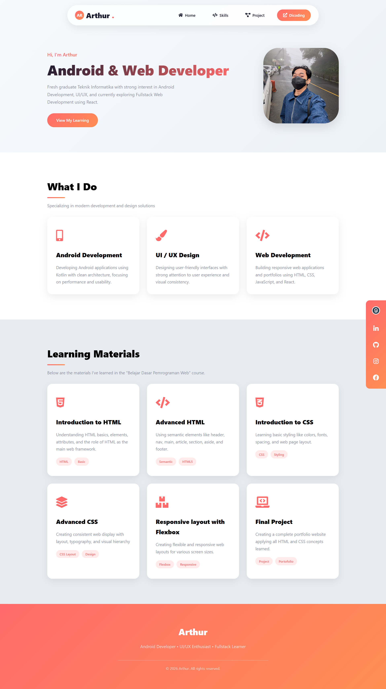

# Personal Website - Dicoding Submission

This project is a personal website built using semantic HTML5 elements as part of Dicoding submission requirements.

## ✨ Features
- Semantic HTML structure (header, nav, main, article, aside, footer)
- Navigation linking to Dicoding profile
- Profile photo displayed in aside section
- Responsive layout

## 🛠️ Technologies Used
- HTML5
- CSS3

## 🚀 Live Demo

[View Live Demo](https://ngatourrohman.github.io/submission-belajar-dasar-web)